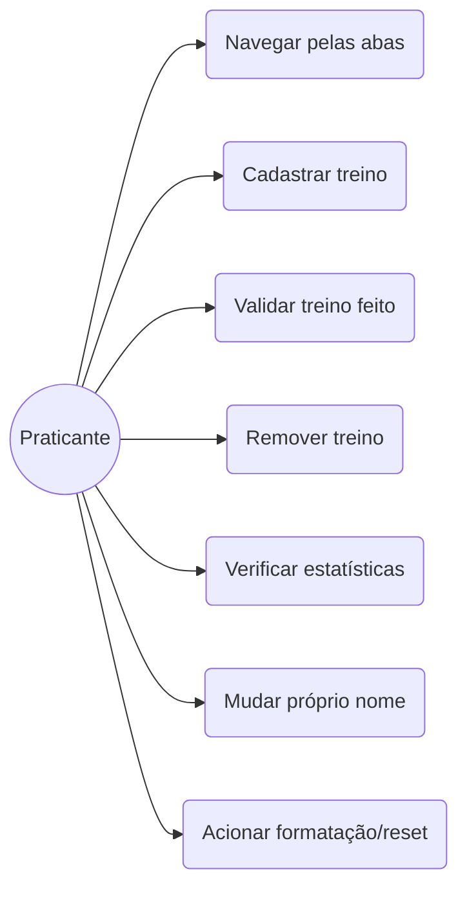
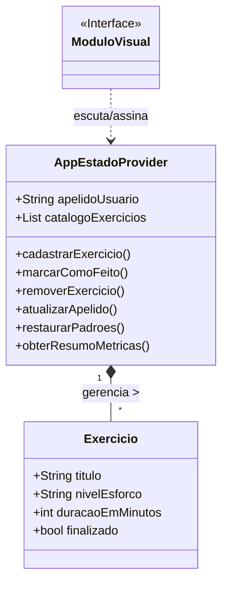

# Fit Life

Aplicativo Flutter para controle simples de atividades físicas com temas personalizados, métricas e navegação inferior.

## Visão Geral

O Fit Life é um app mobile simples para registrar, acompanhar e analisar atividades físicas. Ele usa **Provider** para gerência de estado e uma paleta de cores customizada com fonte **Lexend**.

### Funcionalidades reais do projeto

* Onboarding com entrada de nome do usuário.
* Navegação por **BottomNavigationBar** entre: Atividades, Dashboard e Ajustes.
* Cadastro de atividades com:
  * título
  * duração em minutos
  * dificuldade (Fácil, Média, Difícil)
* Listas separadas de atividades **pendentes** e **concluídas**.
* Marcar tarefas como concluídas e removê-las.
* Dashboard com métricas em colunas:
  * atividades totais
  * atividades concluídas
  * atividades pendentes
  * tempo concluído
  * streak de dias
  * taxa de conclusão
  * duração média
* Distribuição por dificuldade no painel.
* Ajustes com modo escuro e edição de nome diretamente no card.

## Arquitetura do App

O app segue uma organização simples em camadas:

* `lib/main.dart` - ponto de entrada e configuração de tema.
* `lib/tema.dart` - temas claro e escuro personalizados.
* `lib/controllers/controlador_atividades.dart` - lógica de estado e métricas.
* `lib/models/atividade.dart` - modelo de atividade e enum de dificuldade.
* `lib/views/tela_onboarding.dart` - tela inicial de boas-vindas.
* `lib/views/tela_principal.dart` - gerenciador das abas com BottomNavigationBar.
* `lib/views/tela_atividades.dart` - listagem e cadastro de atividades.
* `lib/views/tela_dashboard.dart` - painel de métricas.
* `lib/views/tela_ajustes.dart` - configurações de tema e nome do usuário.
* `lib/widgets/barra_navegacao.dart` - widget de navegação inferior.

## Dependências

* `provider` - para gerenciamento de estado reativo.
* `google_fonts` - para usar a fonte Lexend.

## Observações importantes

* O estado atual é mantido em memória. O app **não persiste dados** entre reinícios.
* Não existe sistema de login ou autenticação.
* Não há integração com banco de dados externo ou API.
* Não há reset de fábrica automático no app atualmente.

## Como executar

```bash
flutter pub get
flutter run
```

## Estrutura de telas

### Tela de Boas-vindas

* Permite inserir um nome de usuário.
* Avança diretamente para a tela principal após o cadastro.

### Tela de Atividades

* Mostra formulário de cadastro.
* Exibe atividades pendentes e concluídas separadamente.
* Permite marcar como concluído e deletar itens.

### Tela de Dashboard

* Exibe métricas atualizadas em colunas.
* Mostra distribuição por dificuldade.

### Tela de Ajustes

* Alterna modo escuro/claro.
* Permite editar diretamente o nome do usuário.

## Atualizações recentes

* BottomNavigationBar aumentada e estilizada.
* AppBar presente em todas as telas.
* Dashboard reformulado para exibir cada métrica em sua própria linha.
* Tema escuro personalizado para manter texto legível.

## Sobre o estilo

A interface usa Material 3 e uma paleta de azul/roxo ciano, com foco em leitura clara e navegação intuitiva.

### 5.2 Aba 2: Catálogo de Exercícios
O núcleo funcional da aplicação.
**Massa de dados inicial exigida:**
* Caminhada (Fácil, 30 min)
* Corrida (Média, 25 min)
* Alongamento (Fácil, 15 min)

É neste módulo que ocorrem o cadastro, a conclusão e a exclusão dos itens.

### 5.3 Aba 3: Painel (Dashboard)
Um agregador de resultados focado na leitura rápida de progresso diário/semanal.

### 5.4 Aba 4: Ajustes (Configurações)
Painel técnico minimalista com apenas duas ações vitais: trocar o nome de exibição e formatar os dados do app.

---

## 6. Modelagem Técnica

### 6.1 Diagrama de Atores e Ações (Casos de Uso)



### 6.2 Desenho de Classes (Lógica de Estado)



---

## 7. Mapeamento de Riscos

| Fator de Risco                           | Severidade | Plano de Contenção                                                                                                    |
| :--------------------------------------- | :--------- | :-------------------------------------------------------------------------------------------------------------------- |
| **Falta de sincronia visual (Provider)** | Crítico    | Garantir a chamada do `notifyListeners()` após cada mutação de dados e utilizar corretamente os `Consumer` nas Views. |
| **Corrupção por dados em branco**        | Moderado   | Impedir habilitação do botão "Salvar" até que o formulário passe nas validações.                                      |
| **Navegação duplicada ou em loop**       | Moderado   | Centralizar o índice da aba atual dentro do próprio estado da `BottomNavigationBar`.                                  |

---

## 8. Checklist de Homologação (Critérios de Aceite Globais)

* [ ] O app compila sem erros no Flutter e renderiza 4 páginas diferentes.
* [ ] A barra inferior (`BottomNavigationBar`) transita corretamente pelas telas sem empilhar rotas (`Navigator.push` infinito).
* [ ] A carga inicial de dados (Caminhada, Corrida, Alongamento) é injetada com sucesso.
* [ ] Inclusão, conclusão e exclusão refletem em milissegundos na UI.
* [ ] O cálculo de porcentagem fecha em ~100% no Dashboard.
* [ ] A alteração do nome modifica a greeting (saudação) na página inicial no exato momento de salvamento.
* [ ] O Provider é a única fonte de verdade (`Single Source of Truth`) para a lista de treinos.

---

## 9. Histórico e Controle do Documento

### 9.1 Alterações de Versão

| Revisão | Data da Publicação | Responsável  | Motivo da Atualização                               |
| :------ | :----------------- | :----------- | :-------------------------------------------------- |
| 1.0.0   | 30/04/2026         | Rian Eduardo | Emissão primária da ERS para o aplicativo Fit Life. |

### 9.2 Validação e Assinaturas

| Entidade                   | Representante | Data       | Aceite |
| :------------------------- | :------------ | :--------- | :----- |
| **Cliente / Orientação**   | Corpo Docente | 30/04/2026 | [  ]   |
| **Engenharia de Software** | Rian Eduardo  | 30/04/2026 | [  ]   |