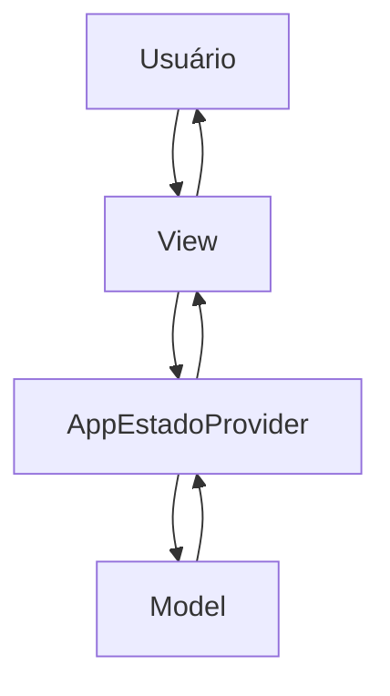
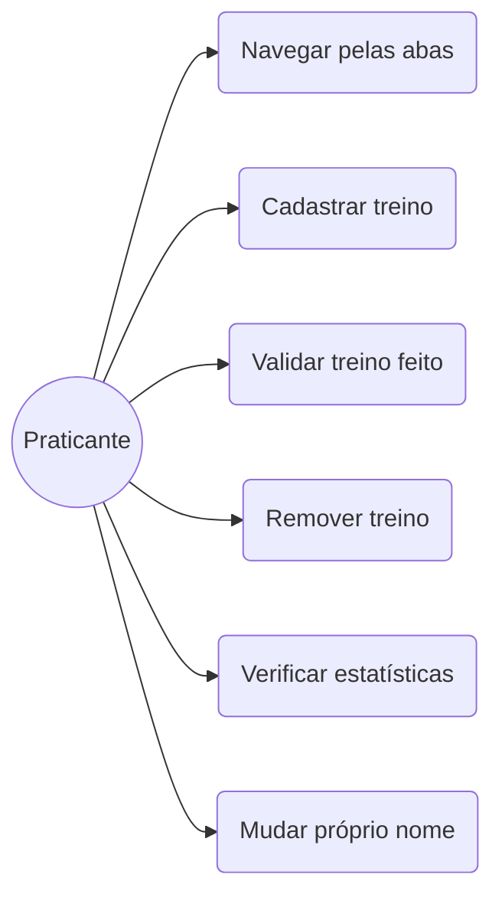
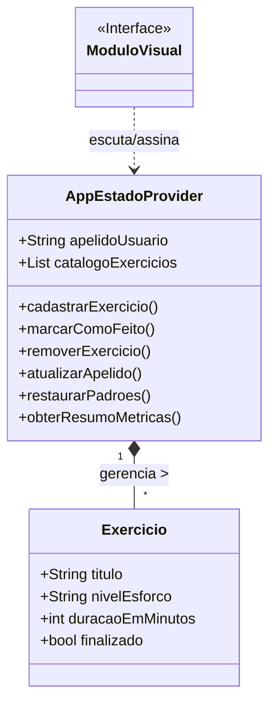

# Documentação de Especificações de Requisitos de Software (SRS)

## Sistema de Gestão de Atividades Físicas (Fit Life)

**Padrão Internacional:** ISO/IEC/IEEE 29148:2018
**Versão:** 1.0.0
**Data:** 2026-04-30
**Autor:** Rian Eduardo

---

## 1. Introdução

### 1.1 Propósito

Este Documento descreve os requisitos do sistema **Fit Life**, com o objetivo de:

* Definir as funcionalidades de acompanhamento e registro de atividades físicas.
* Padronizar entendimentos sobre a arquitetura e gerenciamento de estado.
* Servir como base para desenvolvimento, validação e teste.

---

### 1.2 Escopo

O Sistema permitirá:

* Onboarding e personalização do nome do usuário.
* Cadastro, conclusão e exclusão de treinos/atividades.
* Acompanhamento de progresso diário/semanal através de um Dashboard de métricas.
* Ajustes de interface (modo escuro/claro e formatação de dados).

O Sistema será uma aplicação mobile (front-end) utilizando:

* Flutter e Dart
* Material 3 (paleta customizada e fonte Lexend)
* Provider (Gerenciamento de estado)
* Organização em camadas simples (Views, Models, Controllers)

---

### 1.3 Definições e Acrônimos

Tabela de Termos e Definições

| Termos | Definições |
| - | - |
| Atividade / Treino | Exercício físico registrado pelo usuário (ex: Caminhada, Corrida). |
| Streak | Contagem de dias consecutivos de atividades concluídas. |
| Dashboard | Painel agregador de resultados e estatísticas de progresso. |
| Onboarding | Tela inicial de boas-vindas para o primeiro acesso. |

Lista de Acrônimos

* **SRS:** Software Requirements Specification
* **RF:** Requisitos Funcionais
* **RNF:** Requisitos Não Funcionais
* **UC:** Casos de Uso
* **CA:** Critérios de Aceitação
* **UI:** User Interface (Interface de Usuário)

### 1.4 Visão Geral do Documento

Este Documento está organizado em:

* Introdução e Visão Geral
* Descrição Geral do Sistema
* Requisitos do Sistema
* Regras de Negócio
* Modelos do Sistema
* Matriz de Análise de Risco
* Critérios de Aceite
* Controle de Versões

---

## 2. Descrição Geral do Sistema

### 2.1 Perspectiva do Sistema

O Sistema é uma aplicação mobile *standalone* mantida em memória, operando diretamente no dispositivo móvel do usuário sem dependência de APIs externas.

---

### 2.2 Funções do Sistema

O Sistema deve:

* Cadastrar atividades (título, duração e dificuldade).
* Atualizar o status das atividades (pendente/concluída).
* Exibir painel de métricas (taxa de conclusão, duração média, etc).
* Alternar temas visuais.
* Editar nome de usuário
 
---

### 2.3 Classes de Usuários

| Usuários | Descrição |
| - | - |
| Praticante | Usuário final que utiliza o app para registrar e monitorar seus treinos. |

---

### 2.4 Ambiente Operacional

* Dispositivos Móveis (Android e iOS) suportados pelo framework Flutter.

---

### 2.5 Restrições

* O estado é mantido apenas em memória (o app não persiste dados entre reinícios da aplicação).
* Não existe sistema de login ou autenticação.
* Não há integração com banco de dados externo ou API.

---

### 2.6 Suposições

* O usuário fará a inserção correta dos dados de duração e dificuldade.
* A navegação baseia-se em uma *BottomNavigationBar* e não em empilhamento de telas.

---

## 3. Requisitos do Sistema

### 3.1 Requisitos Funcionais

#### RF-01 [Onboarding e Configuração de Usuário]
**Descrição:** Permitir que o usuário insira um nome no primeiro acesso e o altere nas configurações.
* **Prioridade:** Alta
* **Versão:** 1.0

**Critérios de Aceitação:** * **[ ]** Entrada de Dados: Nome do Usuário.
* **[ ]** Avançar automaticamente para a tela principal após o cadastro inicial.
* **[ ]** Refletir a alteração do nome na saudação (greeting) em tempo real.

#### RF-02 [Cadastro de Atividades]
**Descrição:** Permitir a inclusão de um novo treino.
* **Prioridade:** Alta
* **Versão:** 1.0

**Critérios de Aceitação:** * **[ ]** Entrada de Dados: Título, Duração (min), Dificuldade (Fácil, Média, Difícil).
* **[ ]** Validação dos campos antes de habilitar o botão "Salvar".
* **[ ]** Atualização imediata na lista de "Pendentes".

#### RF-03 [Gestão de Atividades]
**Descrição:** Listar, concluir e excluir atividades.
* **Prioridade:** Alta
* **Versão:** 1.0

**Critérios de Aceitação:** * **[ ]** Exibir listas separadas de atividades pendentes e concluídas.
* **[ ]** Permitir marcar tarefas como concluídas.
* **[ ]** Permitir remover tarefas.

#### RF-04 [Painel Dashboard]
**Descrição:** Exibir métricas e estatísticas das atividades.
* **Prioridade:** Alta
* **Versão:** 1.0

**Critérios de Aceitação:** * **[ ]** Exibir métricas: Total, Concluídas, Pendentes, Tempo, Streak, Taxa de Conclusão e Duração Média.
* **[ ]** Calcular e exibir a distribuição por dificuldade (o cálculo de porcentagem deve fechar em ~100%).

#### RF-05 [Ajustes do Sistema]
**Descrição:** Permitir configurações de interface e dados.
* **Prioridade:** Média
* **Versão:** 1.0

**Critérios de Aceitação:**
* **[ ]** Alternar entre Modo Claro e Modo Escuro.

### 3.2 Requisitos Não-Funcionais

* **RNF-01 [Usabilidade]:** Interface focada em leitura clara e navegação intuitiva, utilizando Material 3 e paleta azul/roxo ciano com fonte Lexend.
* **RNF-02 [Desempenho]:** Inclusão, conclusão e exclusão devem refletir em milissegundos na UI.
* **RNF-03 [Arquitetura]:** Uso do padrão `Provider` para reatividade e como única fonte de verdade (*Single Source of Truth*).
* **RNF-04 [Confiabilidade]:** A barra inferior deve transitar pelas telas sem empilhar rotas infinitamente (`Navigator.push`).

---

## 4. Regras do Negócio

Tabela de Regras
| Regras de Negócio | Descrição |
| - | - |
| RN-01 | O aplicativo deve carregar uma massa de dados inicial obrigatória: Caminhada (Fácil, 30 min), Corrida (Média, 25 min), Alongamento (Fácil, 15 min). |
| RN-02 | A alteração de estado (concluir, excluir) deve recalcular imediatamente as métricas do Dashboard. |
| RN-03 | Formulários incompletos ou em branco não podem ser salvos. |

---

## 5. Modelos do Sistema

### 5.1 Diagrama de Casos de Uso

---

### 5.2 Diagrama de Classes UML (Lógica de Estado)

---

## 6. Matriz de Análise de Risco

| Fator de Risco | Severidade | Plano de Contenção |
| :--- | :--- | :--- |
| **Falta de sincronia visual (Provider)** | Crítico | Garantir a chamada do `notifyListeners()` após cada mutação de dados e utilizar corretamente os `Consumer` nas Views. |
| **Corrupção por dados em branco** | Moderado | Impedir habilitação do botão "Salvar" até que o formulário passe nas validações. |
| **Navegação duplicada ou em loop** | Moderado | Centralizar o índice da aba atual dentro do próprio estado da `BottomNavigationBar`. |

---

## 7. Checklist de Homologação (Critérios de Aceite Globais)

* **[ ]** O app compila sem erros no Flutter e renderiza 4 páginas diferentes.
* **[ ]** A barra inferior transita corretamente pelas telas sem empilhar rotas.
* **[ ]** A carga inicial de dados é injetada com sucesso.
* **[ ]** Inclusão, conclusão e exclusão refletem em milissegundos na UI.
* **[ ]** O cálculo de porcentagem fecha em ~100% no Dashboard.
* **[ ]** A alteração do nome modifica a saudação no exato momento de salvamento.
* **[ ]** O Provider é a única fonte de verdade para a lista de treinos.

---

## 8. Controle de Versões

### 8.1 Histórico de Alterações

| Revisão | Data da Publicação | Responsável | Motivo da Atualização |
| :--- | :--- | :--- | :--- |
| 1.0.0 | 2026-04-30 | Rian Eduardo | Emissão primária da ERS para o aplicativo Fit Life. |

### 8.2 Validação e Assinaturas

| Entidade | Representante | Data | Aceite |
| :--- | :--- | :--- | :--- |
| **Cliente / Orientação** | Corpo Docente | 2026-04-30 | [  ] |
| **Engenharia de Software** | Rian Eduardo | 2026-04-30 | [  ] |
